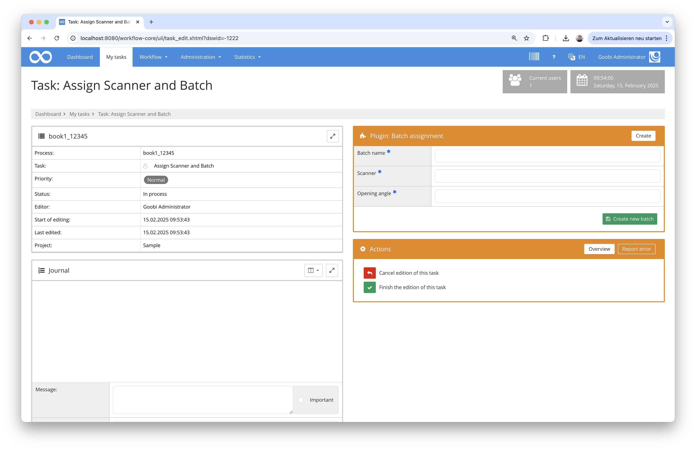
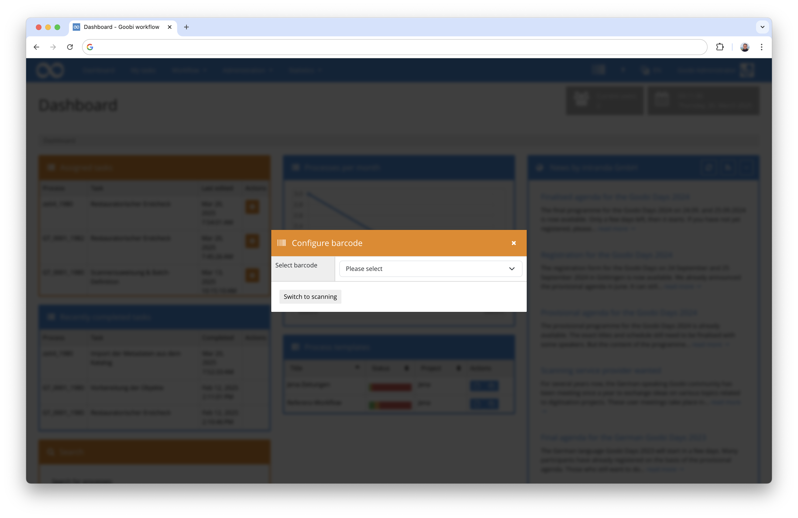
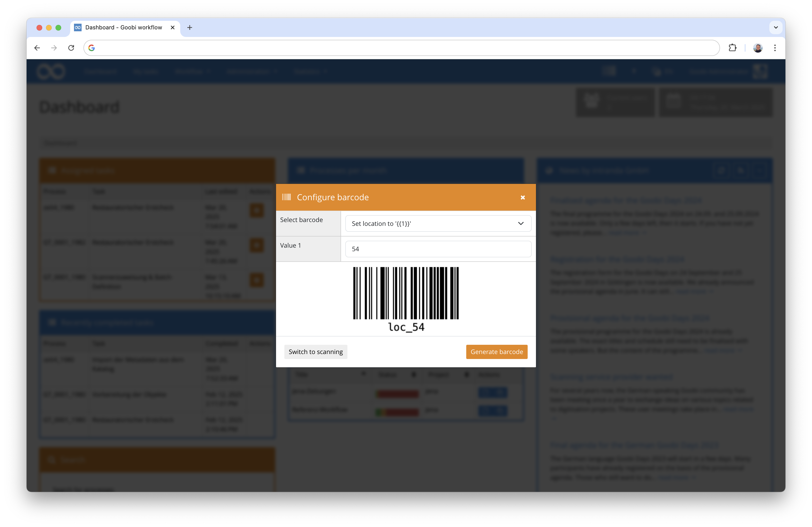

# February 2025

## General information
This month we were finally able to finalise the major conversion of Goobi workflow and all plugins to Java 21. Due to the complexity, we expect that there will certainly be some rework here and there. However, the major changeover has finally been completed and we can now start installing the new versions on users' systems.


## Core

### Conversion to Java 21 and Tomcat 10
The migration of Goobi workflow core to Java 21 and Tomcat 10 has been completed and can be used on production systems from this release onwards. As already mentioned in previous digests, this changeover was necessary in order to be able to continue developing the software itself and its underlying infrastructure in the future and to provide it with security updates. Last but not least, the switch to Java 21 also took place against the background that the individual operating systems under which Goobi is operated are gradually discontinuing their support for Java 11. 

**Caution:** Updating to this new version generally involves increased effort, as in addition to updating the actual Goobi application and the associated plug-ins, an operating system update, a Java update and a Tomcat update are also required. 


### Conversion of the metadata editor to Bootstrap 5
As has already been mentioned here several times, we have made a major change to the user interface in order to migrate the various areas of Goobi workflow and its plugins from Bootstrap 3 to Bootstrap 5. This is not only useful for a contemporary design of the user interface, but also to ensure that we meet the requirements for accessibility requirements and better usability. 


One area that was previously excluded from the developments was the user interface of the metadata editor. Until recently, this was based on Bootstrap 4 and used a slightly different internal template for the display, layout and individual components (such as form fields, boxes, buttons, etc.). With the February 2025 release, we have now removed this different metadata editor infrastructure and also migrated the metadata editor to Bootstrap 5. As a result, the user interface now looks slightly different in some areas. Functionally, however, everything should remain the same as before. What users will probably notice most is that the form fields are now designed in a similar way to the forms that are usually found in Goobi workflow:


The arrangement of the standard data fields, e.g. for persons and places, looks a little tidier than before:


The recording of new structural elements has been slightly revised:


Validation messages are now also displayed in a slightly different form:


Overall, we hope that this change will not only result in a somewhat more standardised user interface with better usability and accessibility, but will also make it easier to further develop the metadata editor in future.


### Refactorisation for the frontend
We have also made some internal changes to the structure of the HTML pages to simplify development. The template based on `JavaServer Faces` was reorganised so that additional `facelet tags` are used. Repeated blocks in the user interface are thus displayed more uniformly and are easier for us as developers to control from a central location. This is also visible to users in the revised properties area:


## Plugins

### New plugin for compiling batches
The functionality of batches is only really used by relatively few users on a daily basis. However, some organisations already work primarily with batches in very large projects in order to run many processes together through their workflows. Previously, it was necessary to either create the batches together when the processes were created and thus combine them into one batch. Or batches had to be compiled in the batch interface in a somewhat cumbersome way. 


With a new plugin, we are now trying to make it easier for other users to work with batches. To this end, a new step plugin has been implemented that enables users within a task to add the respective process to an existing (and still waiting) batch and also to mark this batch as complete so that its further processing can begin.


Alternatively, it is also possible here to create a new batch together with a title and configurable properties, which can also receive other processes for batch processing in the further course.



Detailed documentation of the plugin can be found as usual on our documentation platform: 

[https://docs.goobi.io/workflow-plugins/step/goobi-plugin-step-batch-assignment](https://docs.goobi.io/workflow-plugins/step/goobi-plugin-step-batch-assignment)


### New plugin for convenient handling of barcodes
Goobi workflow has been able to handle barcodes well since the very first versions. The generation of barcodes on dockets, a barcode generation plugin, a mass upload with barcode analysis on images and, of course, searching using barcode readers have long been possible. 

What was still missing, however, was extensive automation of various actions simply by scanning barcodes. We have developed a completely new plugin for this purpose that can be opened at any time from the Goobi worflow interface without leaving the current interface. 


After clicking on the corresponding icon, it opens immediately as a modal above the current interface.


The possibilities here are almost unlimited. For example, stored actions can first be selected by barcode scans (e.g. setting a property, changing a step status, performing an export, manipulating workflows). The selected action can then be executed for the relevant processes with each scan of a process barcode or batch barcode. The elegant thing here is that the actions that can be used are all those that are also available via GoobiScript. 

The actions to be used here can be defined very granularly in the plugin's configuration file. For convenient use of the functionality, it is then possible to generate barcodes for the stored actions directly from the plugin so that they can then be printed out, for example. 



To automatically track the location of an object, it is therefore very easy, for example, to generate barcodes for individual offices, which can then be used for each object when it arrives at an office with a barcode reader and thus carry the current location of the object as a process property in Goobi.



Documentation for this new plugin has not yet been created and is not yet online. This is expected to be published next month.


### Internal changes for handling Riot-based plugins
Due to the switch to Java 21, all plugins that were technically based on the Riot infrastructure and communicated between the frontend and backend via REST had to undergo a major change to the REST connection. As a result, the access rights for some REST endpoints may have to be adjusted after the update to the version described here. Details of the adjustments can always be found in the Goobi workflow update instructions:

[https://docs.goobi.io/goobi-workflow/en/admin/08_update_guide](https://docs.goobi.io/goobi-workflow/en/admin/08_update_guide)


## Code analysis
The following screenshots show the SonarCloud analysis of the current release. Further information can be found directly on the [project page](https://sonarcloud.io/organizations/intranda/projects).


## Version number
The current version number of Goobi workflow with this release is: `25.02`. Within plugin developments, the following dependency must be entered accordingly for Maven projects within the `pom.xml` file:

```xml
<dependency>
    <groupId>io.goobi.workflow</groupId>
    <artifactId>workflow-core</artifactId>
    <version>25.02</version>
    <classifier>classes</classifier>
</dependency>
```