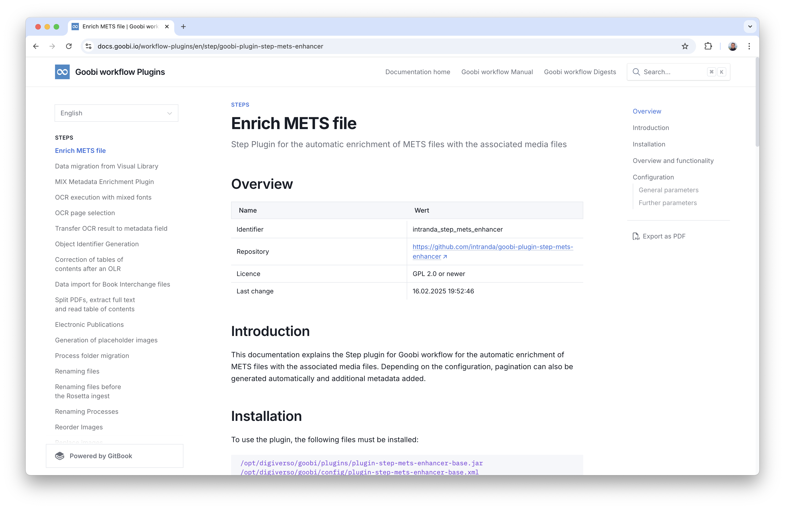

# March 2025

## General information
As expected, the changeover to Java 21 has brought us some additional work. The changes related to both the infrastructure and the user interface, where we completed the Bootstrap 5 conversion at the same time. There is also a major innovation to report in the Goobi-to-go area.


## Core

### Java 21 - Rework here and there
We somehow saw it coming: There was still some rework to be done regarding the major changeover to Java 21. In particular, those plugins that were based on the Riot infrastructure required a few minor changes. Overall, however, these changes were absolutely manageable, so that the new infrastructure based on Java 21 and Tomcat 10 could already go live with some Goobi users.


### Bootstrap 5 - Rework for the conversion of the metadata editor
There was also some minor reworking of the metadata editor. We had already converted it to Bootstrap 5 with the last release, so some areas of the metadata editor looked a little different. However, we have noticed a few minor optimisations, particularly with regard to usability, that still need to be fixed. For example, validation messages that should be displayed directly next to the fields have been slightly restyled:


The popover that appears when you move the mouse pointer over the structural elements in the left-hand area has also been customised with regard to the validation messages:


The seemingly little-known bookmark functionality has also been brought up to date in this context:


The status of the individual boxes, which users can expand and collapse in the structuring and metadata areas, has also been enhanced so that it is now retained when changing pages, thus avoiding unnecessary clicks.

 


### Code cleanup of 200,000 lines
As we believe that the conversion to Bootstrap 5 is complete, we have decided this month to remove some of the legacy layout code. This applies in particular to HTML components, JavaScript files and styling specifications that were still present in various places for the use of Bootstrap 3 and Bootstrap 4 and which were intended to prevent areas that we may have inadvertently not yet converted from continuing to look good and remain usable. From our point of view, these files are no longer in use and have therefore been deleted. As a result, Goobi workflow has suddenly been reduced by around 200,000 lines of redundant source code. For us as developers, this feels good. :)


### French introduced as a language
The popularity of Goobi worklow is apparently continuing to grow. There are always requests for additional languages to be supported. This month, we have therefore added French to the list of supported languages. For us as non-native speakers, this means that we provide the infrastructure for this, that there is a language switcher that now offers French as a language. We have also used automatic translation to ensure that French translations are now available for all labelling displayed in Goobi workflow, e.g. for buttons or fields. However, these have not yet been manually proofread by a native speaker. We are happy to provide interested parties with the language files for each of the languages already available so that they can complete or revise their translations.


## Plugins

### Conditions for the automatic updating of metadata fields
The plugin `goobi-plugin-step-metadata-update-field` has already existed for some time and is used to automatically fill metadata fields from the contents of other metadata fields and also generated information. 


This plugin has now been extended to allow this generation of metadata and thus the update of the METS file of the corresponding process to only be executed if a configured condition is met. An example configuration for this looks like this:

```xml
<config_plugin>
    <config>
		<project>*</project>
		<step>*</step>
        
        <update>
			<field>TitleDocMain</field>
			<element>Monograph</element>
			<forceUpdate>true</forceUpdate>
            <condition field="PublicationYear" value="\d[4}]" />
    		<content type="variable">{meta.CatalogIDDigital}</content>
			<content type="static">_</content>
            <content type="metadata">PublicationYear</content>
		</update>

	</config>
</config_plugin>
```

More detailed information can be found in the plugin documentation, where the configurability of the conditions is also explained:

[https://docs.goobi.io/workflow-plugins/en/step/goobi-plugin-step-metadata-update-field](https://docs.goobi.io/workflow-plugins/en/step/goobi-plugin-step-metadata-update-field)


### New plugin for METS file preparation
In some use cases, there is a need for the METS file of a process to be exported automatically without it having been edited manually by a user in the metadata editor. In such a case, it is usually necessary to enrich the METS file somewhat. In particular, the associated media files (e.g. the images) must be assigned to the METS file, at least at the top level. It may also make sense to automatically assign a pagination of different types or to automatically add other metadata. We have now developed a new plugin called `goobi-plugin-step-mets-enhancer` for such use cases.



As usual, the detailed documentation can be found on our documentation platform here:

[https://docs.goobi.io/workflow-plugins/en/step/goobi-plugin-step-mets-enhancer](https://docs.goobi.io/workflow-plugins/en/step/goobi-plugin-step-mets-enhancer)

The source code of the plugin and the installable version of the plugin can be found here:

[https://github.com/intranda/goobi-plugin-step-mets-enhancer](https://github.com/intranda/goobi-plugin-step-mets-enhancer)


### Conversion of the rich text editor for transcriptions
The `goobi-plugin-step-transcription` plugin has been available for some time now as a relatively simple way of creating transcriptions of images and combining them with format instructions. So far we have used the editor TinyMCE for this purpose. For various reasons, however, we had to make a major change here in order to ensure the further development of the Goobi plugin. We have now decided to use the Quill JavaScript library for this purpose. 


The new editor behaves in much the same way as the previous one. The update should therefore have no negative impact on users and work as usual.

The documentation of the plugin can be found here on our documentation platform:

[https://docs.goobi.io/workflow-plugins/en/step/goobi-plugin-step-transcription](https://docs.goobi.io/workflow-plugins/en/step/goobi-plugin-step-transcription)

The installable plugin can be found here:  

[https://github.com/intranda/goobi-plugin-step-transcription](https://github.com/intranda/goobi-plugin-step-transcription)


## New Goobi-to-go infrastructure
After a long period of work, we have finalised our infrastructure for Goobi-to-go. Initial tests with users are already taking place. What is new here is that the new Goobi-to-go infrastructure is based on Docker and is now much more flexible than before. It also finally runs on all common operating systems again.


We have not yet published the new version of Goobi-to-go independently. Anyone interested in carrying out tests is welcome to contact us at any time. We will then be happy to make this available.


## Version number
The current version number of Goobi workflow with this release is: `25.03`. Within plugin developments, the following dependency must be entered accordingly for Maven projects within the `pom.xml` file:

```xml
<dependency>
    <groupId>io.goobi.workflow</groupId>
    <artifactId>workflow-core</artifactId>
    <version>25.03</version>
    <classifier>classes</classifier>
</dependency>
```