# April 2025

## General
This month, we primarily caught up on a number of digests. These had been somewhat neglected in recent months. However, they have now been fully updated. Of course, we also worked in other areas beyond this.

## Core

### No creation of processes when mandatory fields are missing
When creating processes, it is possible for users to provide metadata and properties. These properties can be of various types (e.g. drop-down fields, text fields, date selectors). It is also possible to define whether the information to be entered is mandatory or optional.

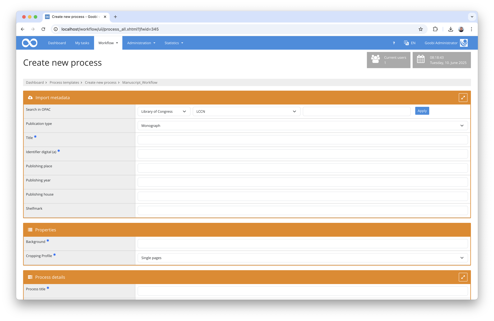

We recently became aware of a malfunction in Goobi in this area. Properties that should have been marked as mandatory were not correctly validated by Goobi, allowing processes to be created even without these required fields being filled out. We have now corrected this behaviour so that an error message is displayed and the process creation is blocked.

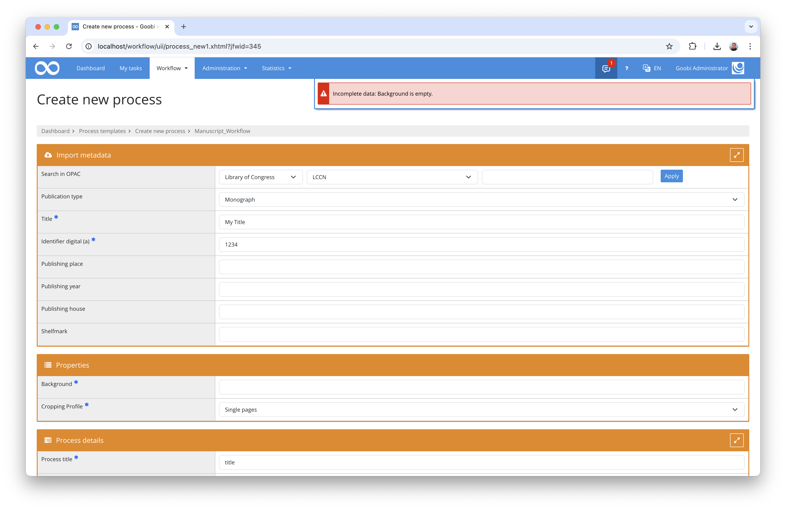

Mandatory metadata fields were not affected by this issue. Since the majority of Goobi users only enter metadata when creating processes, only a minority are likely to have been affected by this malfunction.


### Tooltips as assistance for dropdowns
Like most web applications and websites, Goobi workflow also displays small help texts (tooltips) when hovering the mouse over a button, for example. Although usually very short, these texts can still be quite helpful.

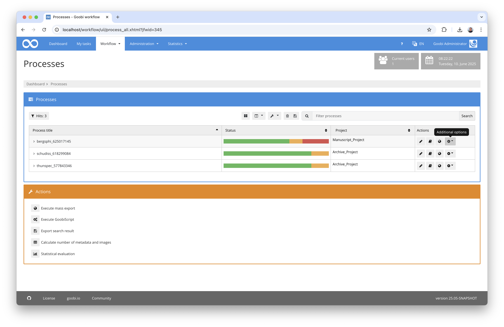

With some drop-down buttons, the tooltips were not displayed in a user-friendly way—they either disappeared too quickly or partially covered the first menu item. We have revised this and harmonised the behaviour in many areas. This should make usage in this area noticeably smoother.


### Dynamic column width for all important tables
Last year, we carefully introduced a new feature, initially activating it only for the process list. This allows users to set the width of displayed columns themselves.

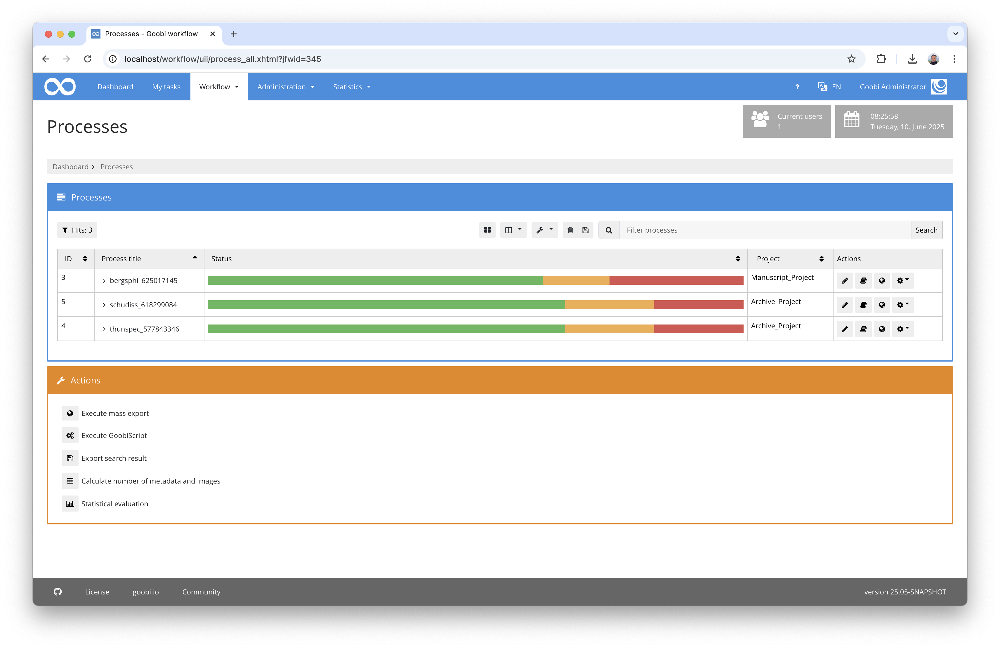

Since no malfunctions have been reported since the introduction of this feature, we have now decided to roll it out for all important tables. This means users can now adjust column widths in their own tasks and across all tables within the administrative area.

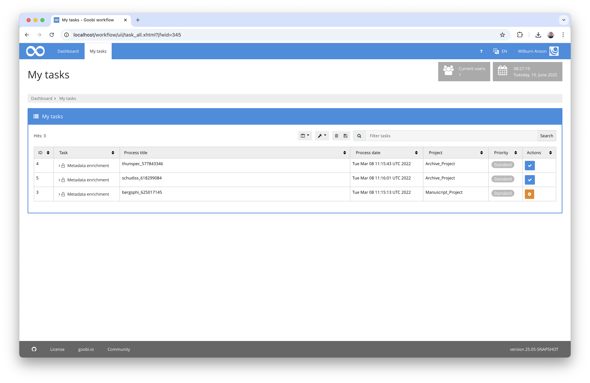

If we have overlooked an important area or an error does occur, please do not hesitate to contact us.

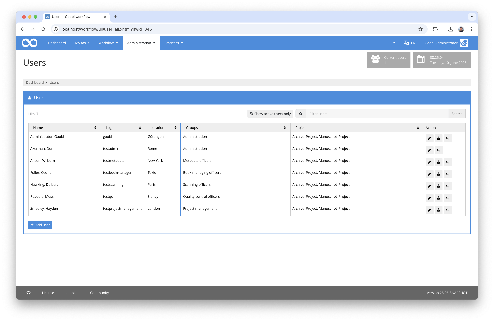


### Scroll to top
If content on a Goobi page becomes very long, it was previously necessary to scroll all the way up to return to the menu entries, for example.

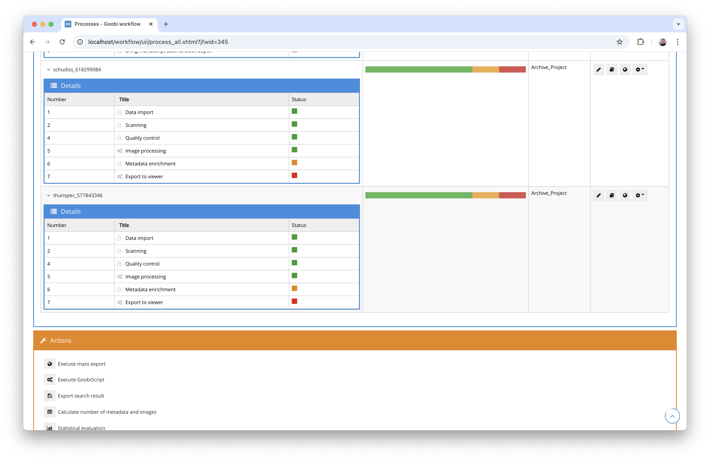

A new button now shows the current scroll status and allows users to quickly return to the top. All rule set editors will love this new feature. :)

## Plugins

### Major overhaul of the Newspaper Recogniser
The plugin for easily capturing newspaper issues has been fundamentally redesigned. Issues and supplements can now be typed in a configurable way. This allows the definition of which structural elements from the rule set are to be written into the metadata for issue and supplement types. Previously, the metadata type for issues was fixed, and supplements were only insufficiently captured in the metadata. This is now much more flexible and powerful.

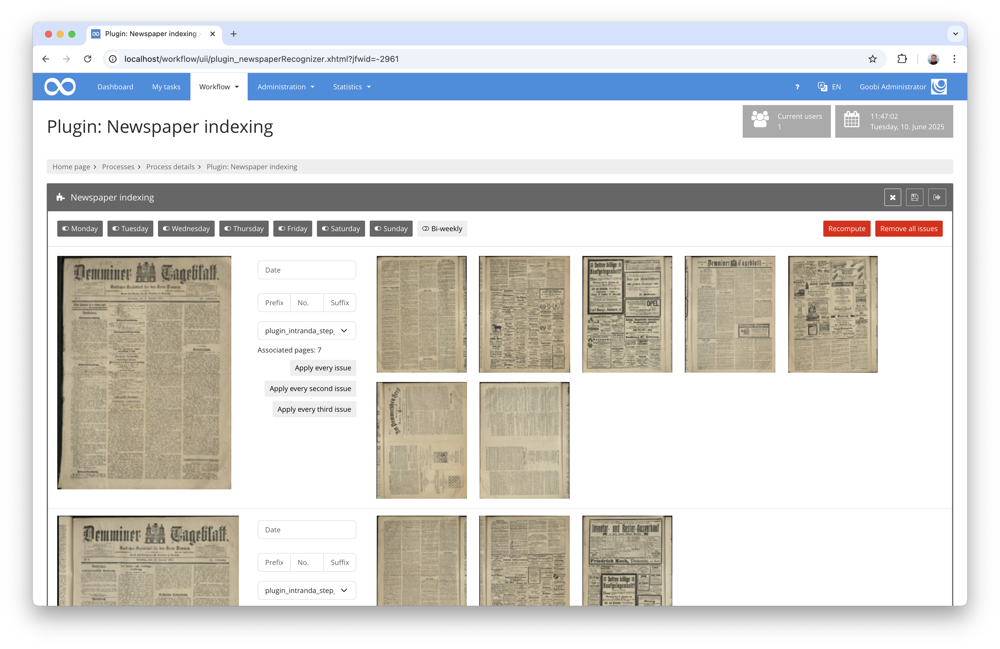

A flexible format can now also be defined for title generation, including a configurable format for dates. Users can thus freely choose the structure for title generation and configure the types for other languages as well.

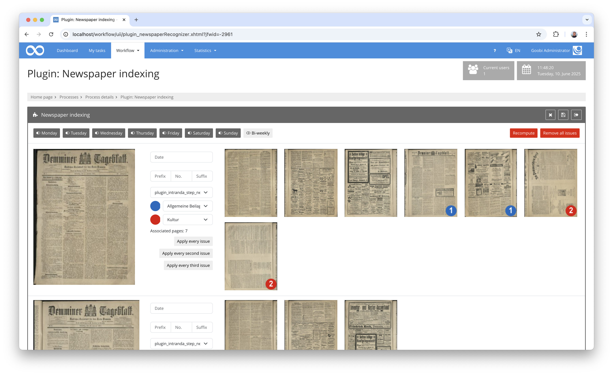

The detailed documentation for the plugin can be found here:

[https://docs.goobi.io/workflow-plugins/en/step/goobi-plugin-step-olr-newspaper-recognizer](https://docs.goobi.io/workflow-plugins/en/step/goobi-plugin-step-olr-newspaper-recognizer)

### Extension of the REST API
The REST API of Goobi workflow has been slightly extended. It is now possible to use anchor and child structures when creating processes via the REST API. This allows multi-volume works or journal volumes to be created via the API.

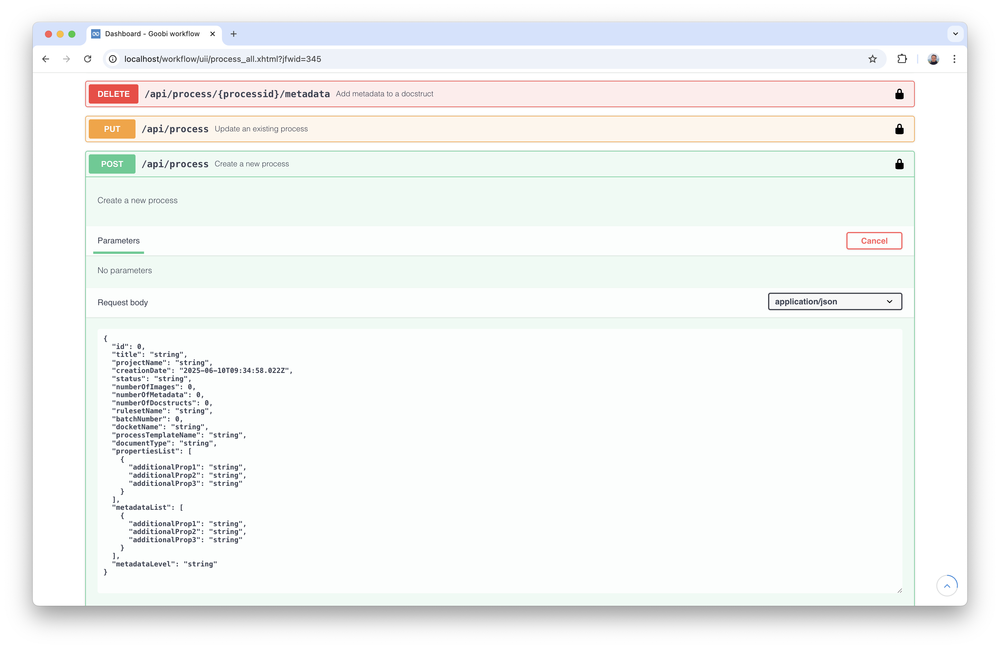

## Code analysis
The following screenshots show the SonarCloud analysis of the current release. Further information can be found directly on the [project page](https://sonarcloud.io/organizations/intranda/projects).

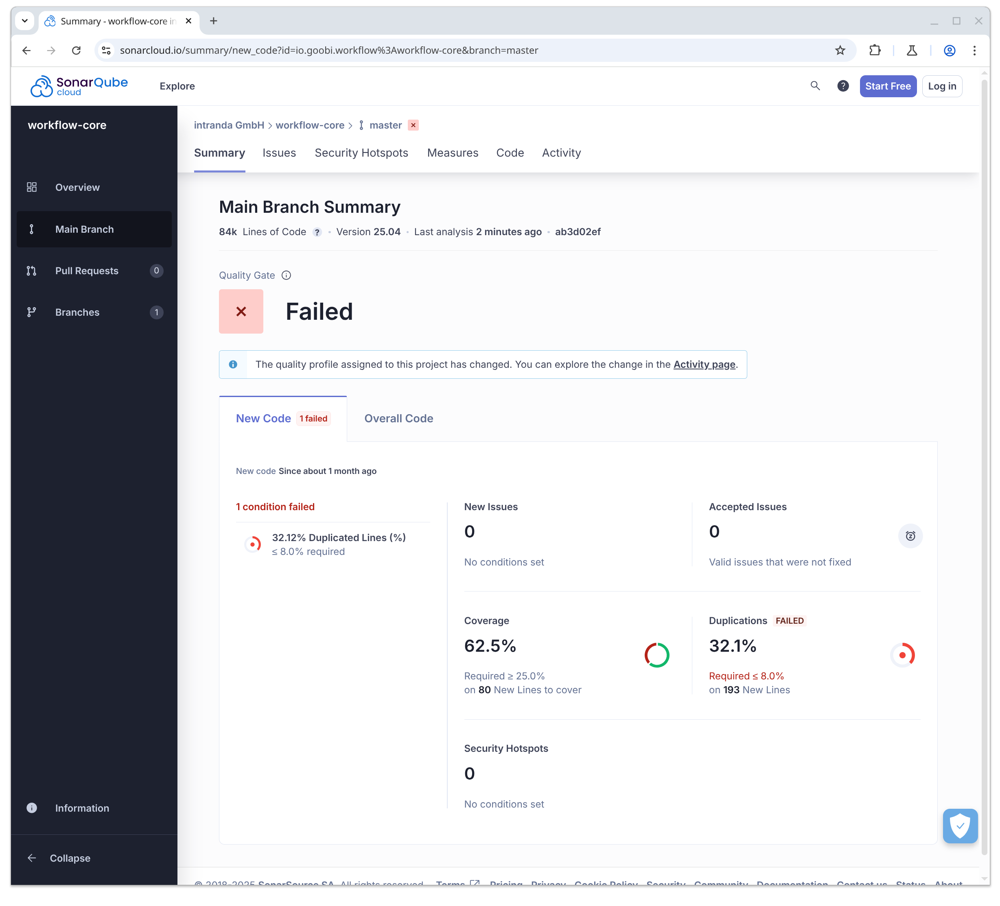

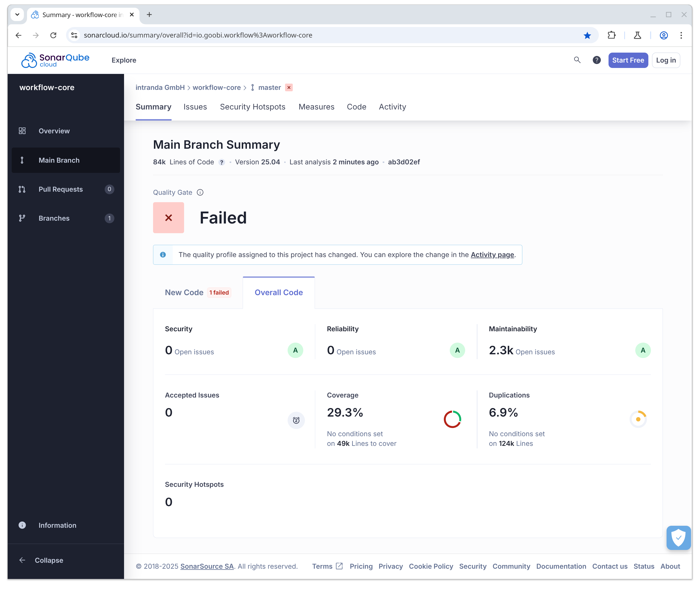

## Version number
The current version number of Goobi workflow with this release is: `25.04`. Within plugin developments, the following dependency must be entered accordingly for Maven projects within the `pom.xml` file:

```xml
<dependency>
    <groupId>io.goobi.workflow</groupId>
    <artifactId>workflow-core</artifactId>
    <version>25.04</version>
    <classifier>classes</classifier>
</dependency>
```