# May 2025

## General
This month we have made some visual adjustments to improve accessibility and usability. We also finalised a major construction site regarding the process properties. There were new features in various plugins. And the revised ruleset editor is now available.

## Core


### Improving the menu for clear labelling of the active area
For good accessibility, it is important that the active menu item can be easily distinguished from the non-active menu items. Previously, this was done in the menu by giving the active menu item a different background and foreground colour.

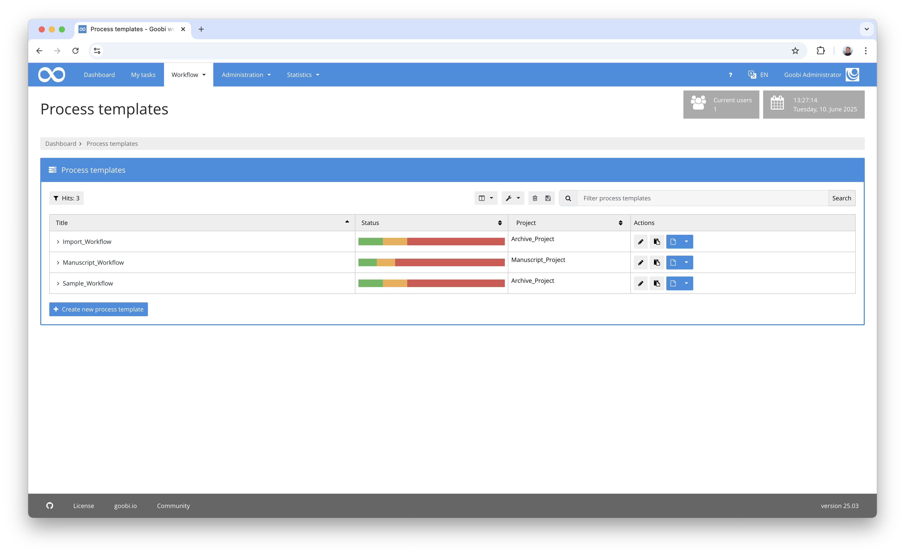

However, according to current requirements, this alone is not enough to clearly identify the activity. In addition to a different colour, a further criterion had to be added here.

Revised menu display](202505_menu2_en.png)

We have therefore decided to handle the menu items in slightly different ways. The active menu item is now designed to look more like a tab. This means that the visual appearance has largely been retained, but the accessibility requirements have been met.


### Simplified access to high-contrast display for WCAG
A few years ago, we created an option in Goobi workflow that allowed users to select a setting for a high-contrast display. Later, we also added the option for users to activate a special WCAG mode that enabled fulfilment of the accessibility requirement in accordance with WCAG. We have now revised and merged these two modes. In addition, we have now incorporated other WCAG requirements so centrally in Goobi that they no longer need to be switched on explicitly. The only problem we haven't been able to solve yet is the choice of colour for the boxes with the white text on them. For this reason, we have now come to the following compromise:

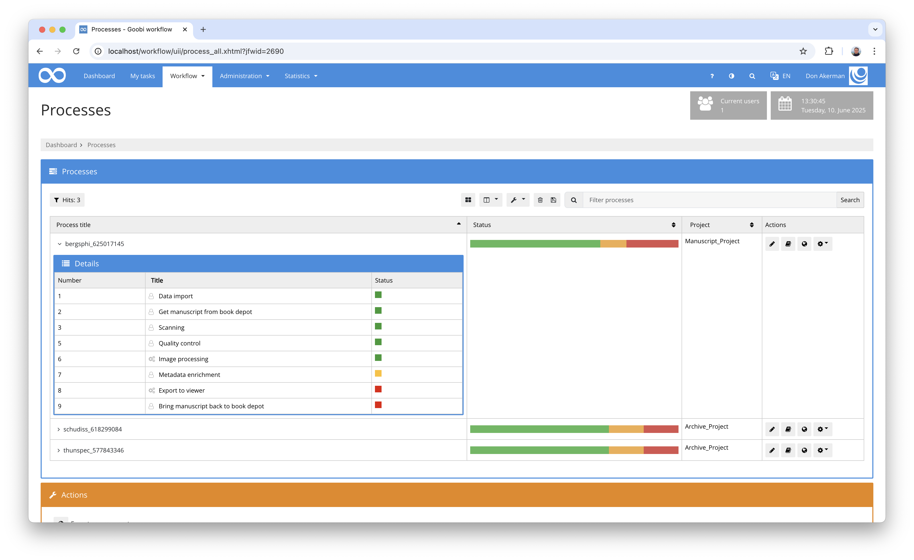

We have now merged the previous WCAG mode and the previous high contrast mode into one contrast mode. From now on, this can be easily switched via the menu bar without having to go to the user's settings. If this mode is activated, the contrast of the coloured boxes is increased by making both blue and orange boxes slightly darker. In addition, some functions that can normally only be distinguished by their colour display a small explanatory note next to them.

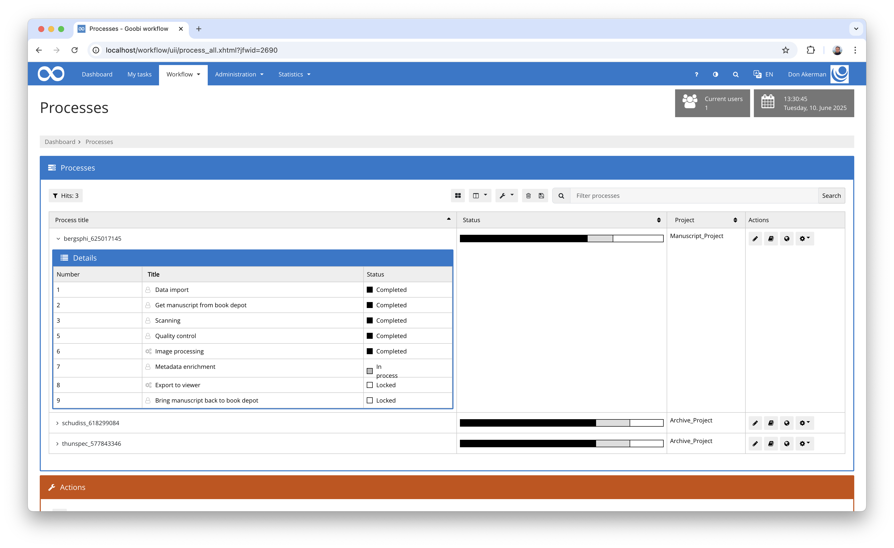


### New global search directly from the menu
This month we also solved the last outstanding point for fulfilment of the German accessibility requirements BITV. In addition to the classic menu, an application such as Goobi must also be able to access content easily in other ways. We have solved this by integrating a global search in the menu bar. This is available at all times and allows you to use the usual search syntax that is already used for processes and tasks and is described in detail here:

[https://docs.goobi.io/goobi-workflow/de/manager/06_processes/01_search](https://docs.goobi.io/goobi-workflow/de/manager/06_processes/01_search)

If you activate the search there, you can simply enter the desired search term and decide whether to search within the tasks or within your own tasks - provided the current user has the necessary authorisation.

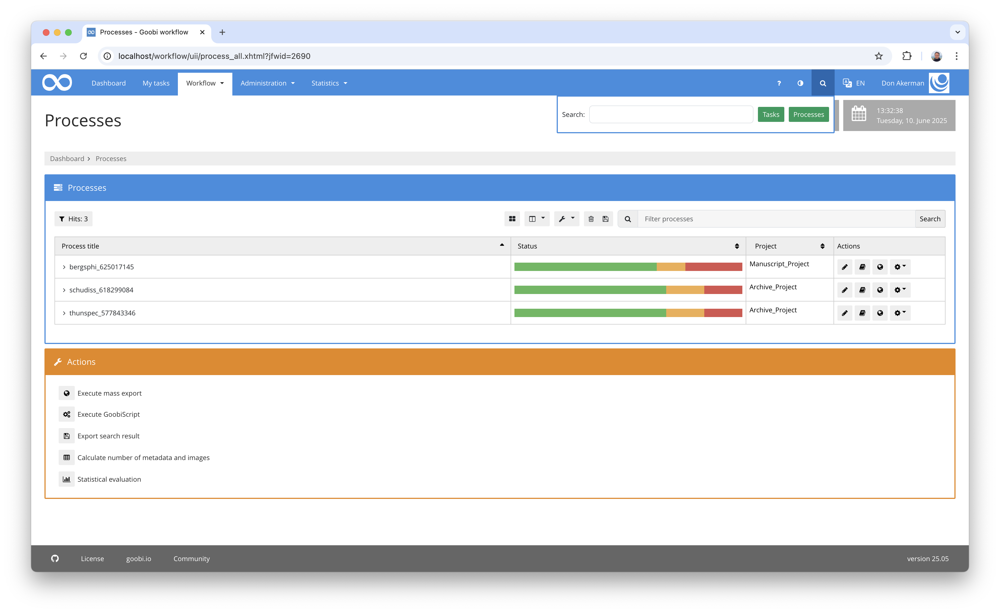

And for users in a hurry, we have also enabled two different search options here:

- If you press the `Enter` key after entering the search, the system searches in your own tasks by default.
- If, on the other hand, you press 'Shift' and the 'Enter' key, the search is performed within the tasks.


### New management of properties
Several years ago, we conducted a survey at the Goobi Days to ask whether we could actually do away with the so-called template properties and workpiece properties. A considerable majority were in favour and we decided together that the properties previously stored there were actually redundant with those from the respective METS file anyway.

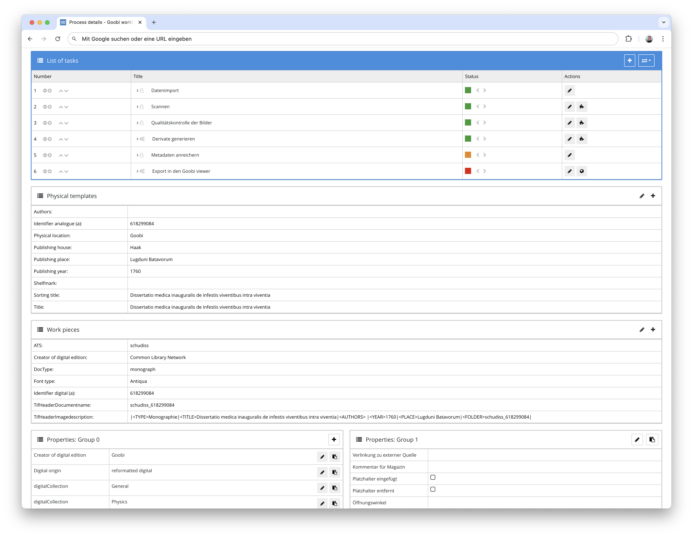

For this reason, it had been planned for some time to simply merge these properties with those of the operations. We have now implemented this change. When the update is installed, Goobi workflow automatically transfers all existing workpiece and template properties to the process properties. This results in much clearer processing of the properties.

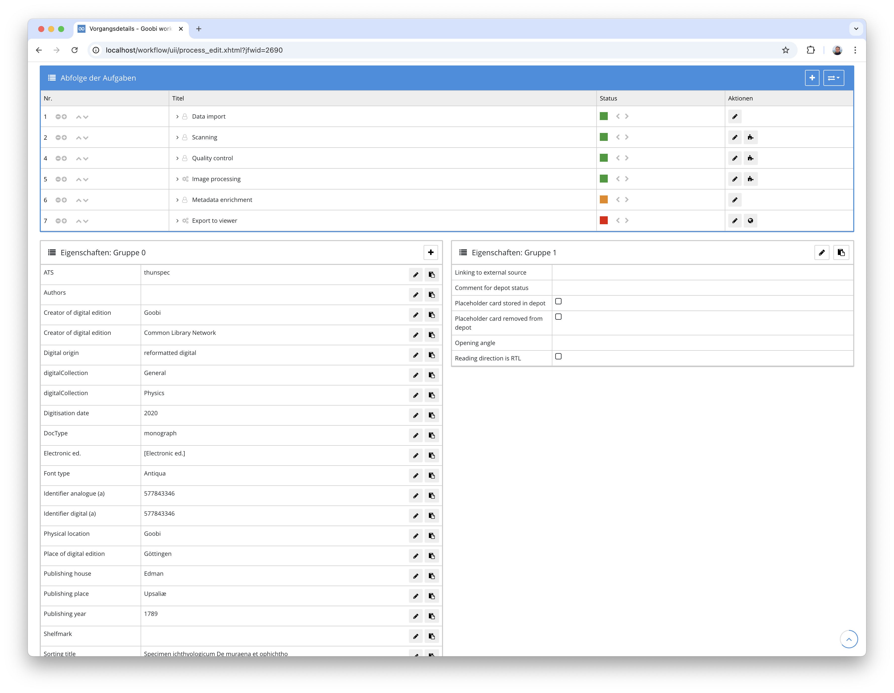

In addition, all of these properties can now be grouped individually in a completely different way since the grouping capability has been expanded. Strictly speaking, this simplification of data management is therefore even much more flexible for end users than before.

Individually configured and named grouping of process properties](202505_properties3_en.png)

An explanation of how properties can be grouped can be found as usual at the following address:

[https://docs.goobi.io/goobi-workflow/de/admin/06_config_files/10_goobi_processproperties.xml](https://docs.goobi.io/goobi-workflow/de/admin/06_config_files/10_goobi_processproperties.xml)


### Properties in the projects
The internally revised management of properties has been designed in such a way that from now on properties can no longer relate solely to processes. Other areas in Goobi are also conceivable here, such as batches, institutions, user groups, rule sets and much more. But let's start with the projects. These now offer the option of having their own properties in another tab of the project details. These properties can then be analysed by automatisms or plugins for conditional execution of workflows, special exports or other future developments.

Our first use case for this is the special export to the long-term archive Arche of the Academy of Sciences in Vienna.

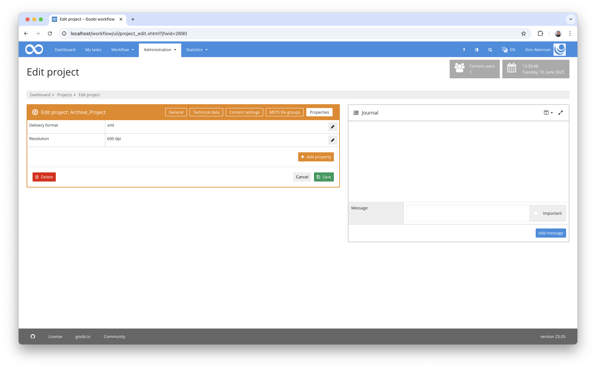


### Extension of the ruleset editor and integration into the Goobi core
Anyone who has ever worked intensively with Goobi workflow will of course have heard of rulesets. These are central configurations for handling and mapping metadata as well as for exchanging data with catalogue systems and exporting or publishing, e.g. as METS or LIDO files.

```xml
  [...]
  <MetadataType>
    <Name>TitleDocMain</Name>
    <language name="de">Haupttitel</language>
    <language name="en">Main title</language>
    <language name="es">Título principal</language>
  </MetadataType>
  [...]
  <MetadataType>
    <Name>FontType</Name>
    <language name="de">Schrifttyp</language>
    <language name="en">Font type</language>
  </MetadataType>
  [...]
  <Group>
    <Name>AccrualsGroup</Name>
    <language name="de">Informationen über voraussichtliche Ergänzungen</language>
    <language name="en">anticipated additions</language>
    <metadata DefaultDisplay="true" num="1o">Title</metadata>
    <metadata DefaultDisplay="true" num="1o">Description</metadata>
    <metadata DefaultDisplay="true" num="1o">Date</metadata>
  </Group>
  [...]
  <DocStrctType>
    <Name>Epilogue</Name>
    <language name="de">Nachwort</language>
    <language name="en">Epilogue</language>
    <language name="es">Epílogo</language>
    <allowedchildtype>Appendix</allowedchildtype>
    <allowedchildtype>Introduction</allowedchildtype>
    <allowedchildtype>Chapter</allowedchildtype>
    <allowedchildtype>Errata</allowedchildtype>
    <allowedchildtype>OtherDocStrct</allowedchildtype>
    <allowedchildtype>Preface</allowedchildtype>
    <metadata num="*">Author</metadata>
    <metadata num="*">TitleDocMainShort</metadata>
    <metadata num="1o">TitleDocMain</metadata>
    <metadata num="*">_ucc_id</metadata>
    <metadata num="*">DocLanguage</metadata>
    <metadata num="*">Composer</metadata>
    <metadata num="1o">_urn</metadata>
  </DocStrctType>
  [...]
```

These rule sets are therefore very extensive configuration files that are quite time-consuming to edit and can easily contain errors. For this reason, we have been providing a plugin for editing for several years now, which also allows simple validation of the rule sets.

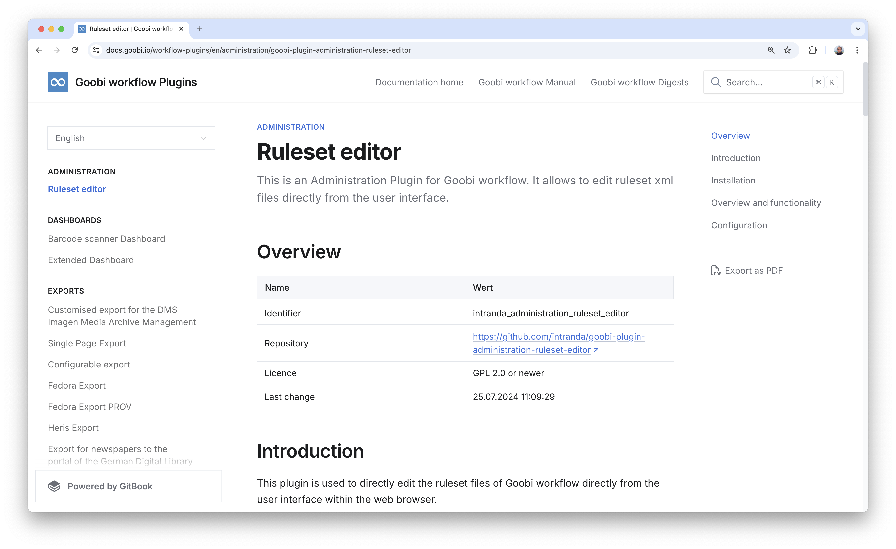

This plugin has now been fully integrated into the core of Goobi workflow. The added value of the plugin was simply so great that more and more users are asking for it to be installed and benefiting from its easier configurability.

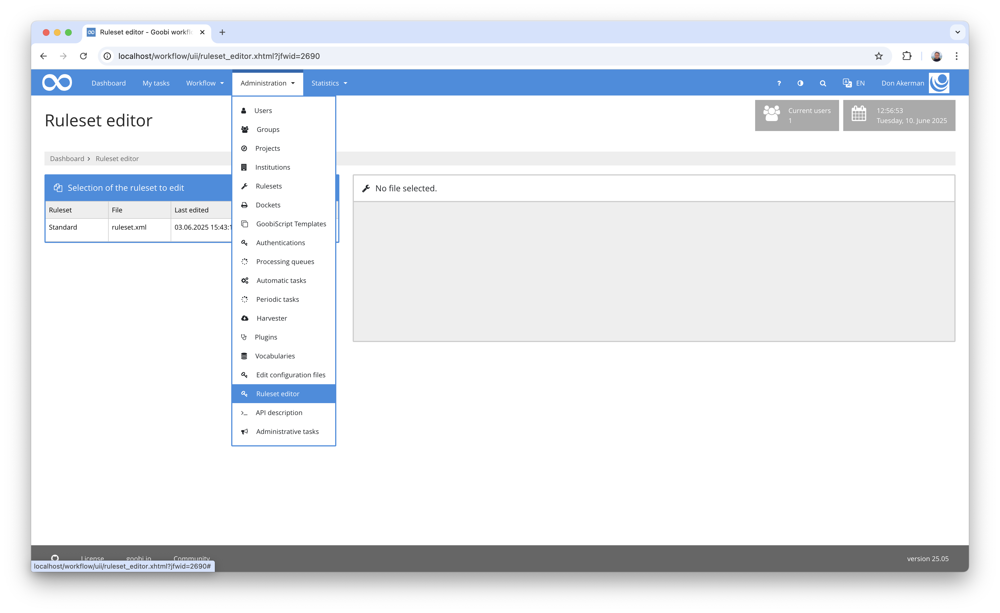

However, in addition to simply moving the plugin to the core of Goobi, we have also taken the opportunity to add several new functions from which everyone can now actually benefit. The validations have been massively expanded. For example, the following is now checked when editing rule sets:

- **Well-formedness:** Are all open tags `<>` also closed? Are invalid characters used? Are attributes used in the wrong place?

- **Incorrect names:** Do all `<MetadataType>`, `<Group>`, `<DocStrct>` and export formats have an element `<Name>` (or for some export formats an element `<InternalName>`) and is its value not empty?

- **Missing translations:** Is every value listed in a `<language>` element not empty or does it consist only of spaces?

- **Invalid cardinality:** Is every subelement of `<DocStrctType>` of type `<metadata>` and `<group>` a valid value specified under the attribute `num`? Valid values are only: `1o`, `*`, `1m` and `+`.

- **Multiple defined values:** Are all `<MetadataType>`, `<Group>` and `<DocStrctType>` elements only defined once?

- **Duplicates:** Have the same `<metadata>`, `<allowedChildType>` or `<group>` elements been used more than once within `<Group>` or `<DocStrctType>`?

- **Usage of publication types:** Were `<DocStrctType>` elements with the attribute `<topStruct="true">` incorrectly used within `<DocStrctType>` elements as `<allowedchildType>`?

- **Undefined metadata types:** Is a `<metadata>` element listed within `<Group>`, `<DocStrct>` and in the export formats which has not been defined as `<MetadataType>`?

- **Unused metadata types:** Is a `<MetadataType>` element defined but not used in `<Group>`,`<DocStrct>` or within export formats?

- **Unused structure types:** Is a `<DocStrctType>` element defined but not used in any `<DocStrctType>` other than `<allowedchildtype>`?

- **Unmapped structure types:** Are `<DocStrctType>`, `<MetadataType>` and `<Group>` elements defined but not used in the export?

The errors detected are now displayed in descending order of urgency and also indicate the specific line number in which the error was detected.

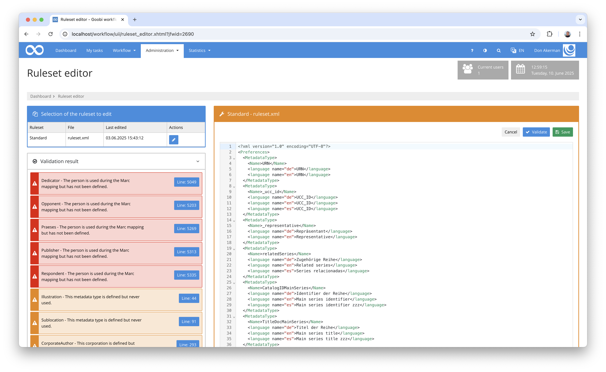

In addition, you can now simply click on these line numbers and Goobi will automatically scroll to the relevant line. This line is then also highlighted in colour.

And that's not all: we've also carried out a major overhaul of the entire loading and display mechanism. Validation has dropped to less than 10% of the previous slower execution speed, despite the expanded new checking options. And thanks to the use of Code-Mirror 6 as an embedded editor, entering a rule set alone and reloading now also takes place in a fraction of the time previously.

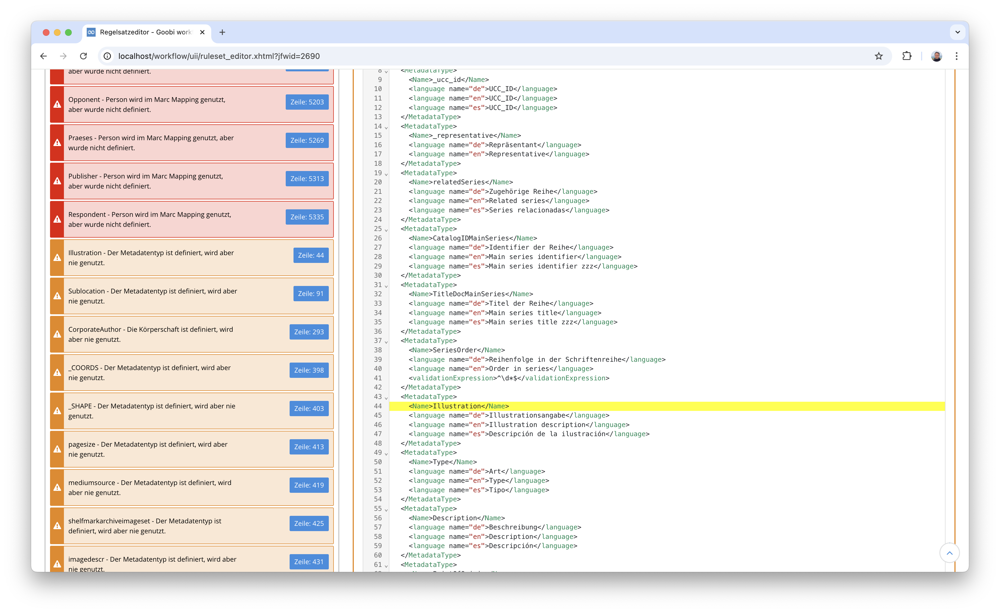

All in all, the changes and enhancements to the new rule set editor are so enormous that every user will immediately notice them for themselves. Try it out!

And if you are interested in the documentation, we have created a separate page for this in our central documentation. It can be found at this address:

[https://docs.goobi.io/goobi-workflow/en/manager/10_ruleset_editor](https://docs.goobi.io/goobi-workflow/en/manager/10_ruleset_editor)

The associated configuration file is also explained here:

[https://docs.goobi.io/goobi-workflow/en/admin/06_config_files/17_goobi_ruleseteditor](https://docs.goobi.io/goobi-workflow/en/admin/06_config_files/17_goobi_ruleseteditor)


### Extension of the configuration editor
As the loading and display speed in the rule set editor has increased enormously, we have also equipped the configuration editor with Code Mirror 6. Here, too, the loading times and the entire handling of files have now become significantly better and more performant.

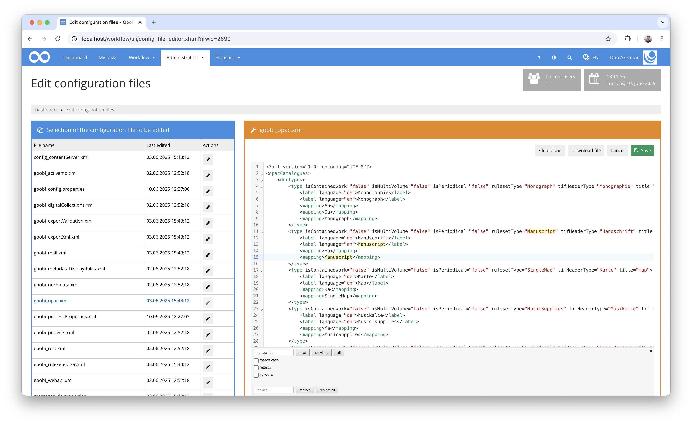

There is now a separate page in our documentation for the configuration of the configuration file editor. This can be found here:

[https://docs.goobi.io/goobi-workflow/en/admin/06_config_files/16_goobi_configeditor](https://docs.goobi.io/goobi-workflow/en/admin/06_config_files/16_goobi_configeditor)


## Plugins

### Connection to ACTApro
We have developed a connection between Goobi workflow and the ACTApro archive system for the library of the Vienna University of Economics and Business. In order to use it, Goobi workflow requires the archive management plugin to be running. If this requirement is met and everything is configured correctly, the new mechanism allows Goobi to periodically retrieve information from ACTApro and thus update the archive holdings in Archive Management. If additional metadata for individual directory units is recorded within Archive Management and the archive holdings are thus enriched, the plugin provides an automatic mechanism that allows this enriched metadata to be returned to ACTApro. This makes it possible to synchronise the inventory information in both systems.

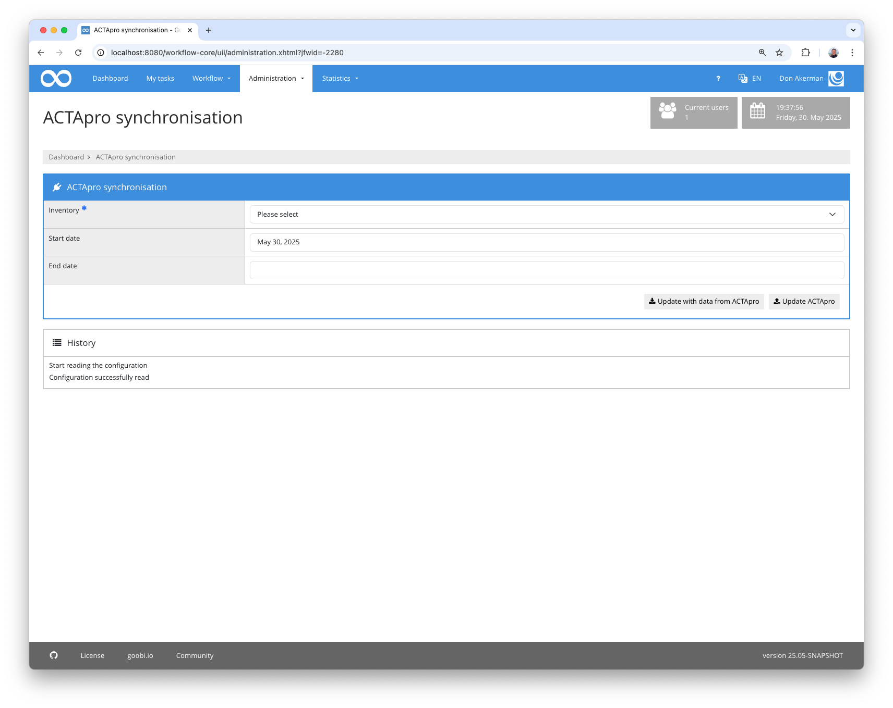

Detailed information on the plugin and its configuration can be found here in the detailed documentation:

[https://docs.goobi.io/workflow-plugins/en/administration/goobi-plugin-administration-actapro-sync](https://docs.goobi.io/workflow-plugins/en/administration/goobi-plugin-administration-actapro-sync)

[https://docs.goobi.io/workflow-plugins/en/step/goobi-plugin-step-actapro](https://docs.goobi.io/workflow-plugins/en/step/goobi-plugin-step-actapro)

### Renaming plugin
A new module for file name generation and an extended counter component have been added to the renaming plugin. File names can now also contain process metadata that is stored in the structural elements of the respective image file. If several structural elements come into question, the desired type can be specifically selected. The counter component, which enables consecutive numbering, has been extended so that the counter can now be reset for each structural element. This makes it possible, for example, to have the numbering within a chapter or similar structural units always start at one.

The documentation of the plugin and its configuration can be found here:

[https://docs.goobi.io/workflow-plugins/en/step/goobi-plugin-step-rename-files](https://docs.goobi.io/workflow-plugins/en/step/goobi-plugin-step-rename-files)


### Further adjustments to plugins
In addition to the adjustments to the fairly widespread plugins described above, there have also been other changes to plugins, some of which are only used by a few users. Some of these are briefly mentioned here:

There have been some adjustments to the plugin for importing Excel files at ETH Zurich for dealing with archive records. The documentation for this can be found at this address: [https://docs.goobi.io/workflow-plugins/en/import/goobi-plugin-import-eth-no-catalogue](https://docs.goobi.io/workflow-plugins/en/import/goobi-plugin-import-eth-no-catalogue)

Various minor changes and corrections were made to the archive management plugin. These affected, among other things, the behaviour after deleting archive nodes, duplicating data, changing the node type and generally dealing with sub-nodes. The current documentation can be found here as usual: [https://docs.goobi.io/workflow-plugins/en/administration/goobi-plugin-administration-archive-management](https://docs.goobi.io/workflow-plugins/en/administration/goobi-plugin-administration-archive-management)

A new export plugin has been implemented for the National Library of Wales, which allows data to be provided in highly customised formats. The extent to which this plugin can be used by other users cannot yet be assessed. Some further adjustments will follow shortly, which we will then report on again.

The REST API has been adapted so that when creating task titles, the system checks which characters are included more consistently. Spaces and other special characters are now consistently replaced with underscores.

Various visual adjustments have been made to the entity editor plugin to improve usability. For example, the scroll position is better analysed and used. There have also been adjustments to the height of the content display and other minor changes.

The documentation for the change workflow plugin has been better documented with regard to the use of conditions. The documentation can be found here: [https://docs.goobi.io/workflow-plugins/en/step/goobi-plugin-step-change-workflow](https://docs.goobi.io/workflow-plugins/en/step/goobi-plugin-step-change-workflow)


## Code Analysis
The following screenshots show the SonarCloud analysis of the current release. More information is available on the [project page](https://sonarcloud.io/organizations/intranda/projects).


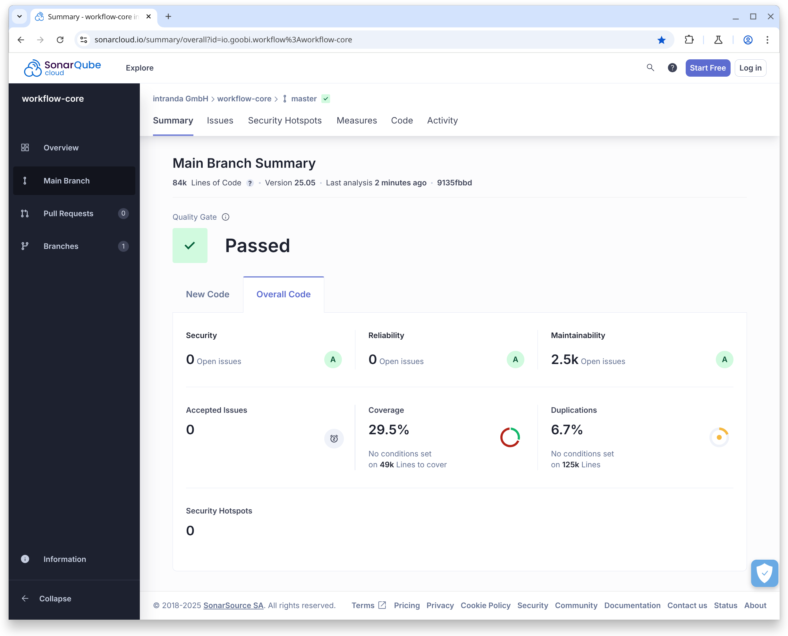


## Version Number
The current version number of Goobi workflow with this release is: `25.05`. For plugin development, the following dependency should be used in the `pom.xml` file of Maven projects:

```xml
<dependency>
    <groupId>io.goobi.workflow</groupId>
    <artifactId>workflow-core</artifactId>
    <version>25.05</version>
    <classifier>classes</classifier>
</dependency>
```